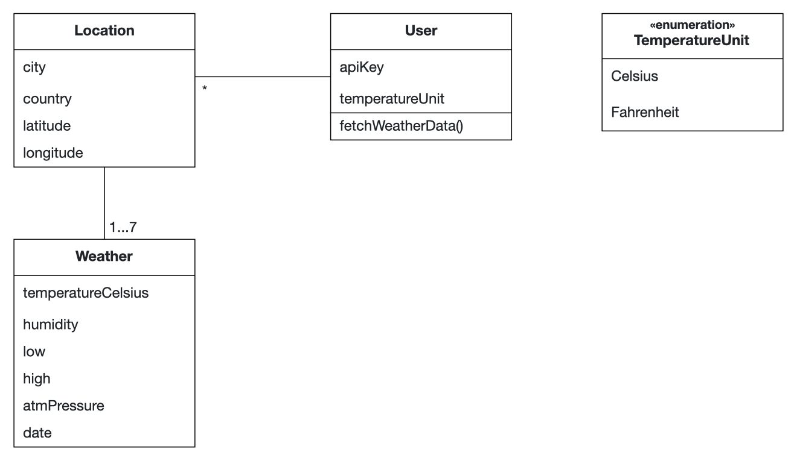
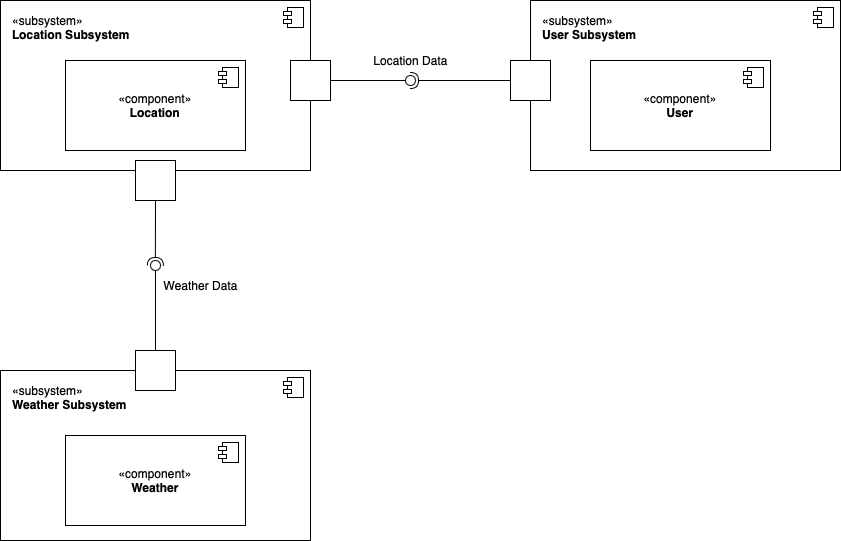

# Intro Course Project App of Matteo Luppi for the iPraktikum

To pass the intro course, you need to create your own unique iOS app (based on SwiftUI).

There are no requirements regarding the functions of your app, so you can get creative.
However, we provide you with Non-Functional Requirements (NFR) that your app needs to fulfill.

After each day of learning new Swift and SwiftUI concepts, these NFRs may change, or new NFRs get added.

## Submission procedure

You get a **personal repository** on Gitlab to work on your app.

Once you implemented a new feature into your app, you need to create a Merge Request (MR - Sometimes we will also reference these as "Pull Requests"(PR)) to merge your changes from the feature branch into your main branch.

Your tutor will review your changes and either request changes or approves the MR.

If your MR got approved, you also need to merge it!

### Deadline: **09.04.2024 23:59**

Until the deadline all of your PRs **need to be merged** and your final app **needs to fulfill** all of the requested NFRs!

---

## Problem Statement (max. 500 words)

As a student, I'd appreciate having an iOS app that provides weather forecasts for cities I plan to visit. The app should allow me to easily search for and save locations to my preferences for quick access. I'd like to view the 7-day forecast, along with graphical representations of temperature, wind, and pressure trends.

## Requirements

Non-Functional Requirements:

- The app should have at least 5 +/- 2 custom SwiftUI views created by you
- You should use Apple's SF-Symbols
- The app should follow Apple's Human Interface Guidelines
- Make sure that your app supports dark mode
- You should ensure that your source code follows best practices, is readable, and easy to understand:
- Follow coding guidelines (See Swift API Design Guidelines)
- Comment your code inline
- A README template will be provided in your repository that lays out the general structure of the
documentation format we are expecting. It is especially relevant to briefly document the
requirements you fulfilled with your app and HOW you fulfilled them.

Functional Requirements:

- The app should provide a user-friendly interface to search for locations.
- Users should be able to save preferred locations to their preferences. 
- The app must display a 7-day weather forecast for the selected location.
- Forecasts should include at least daily highs and lows, current temperature and humidity.
- The app should present graphical charts for temperature and humidity.
- The app must fetch weather data from a reliable and accurate source.
- Weather data should be updated regularly to reflect current conditions and forecasts.
- The app should allow users to customize settings:
    - Celsius <-> Fahrenheit
    - Delete all the locations

## Analysis

## System Design

## Product Backlog

- Search for a location
- Add a new location
- See location list
- See weather forecast of a specific location
- Edit temperature measurement unit
- Delete all the locations
- Implement charts
- Integrate reliable weather API
